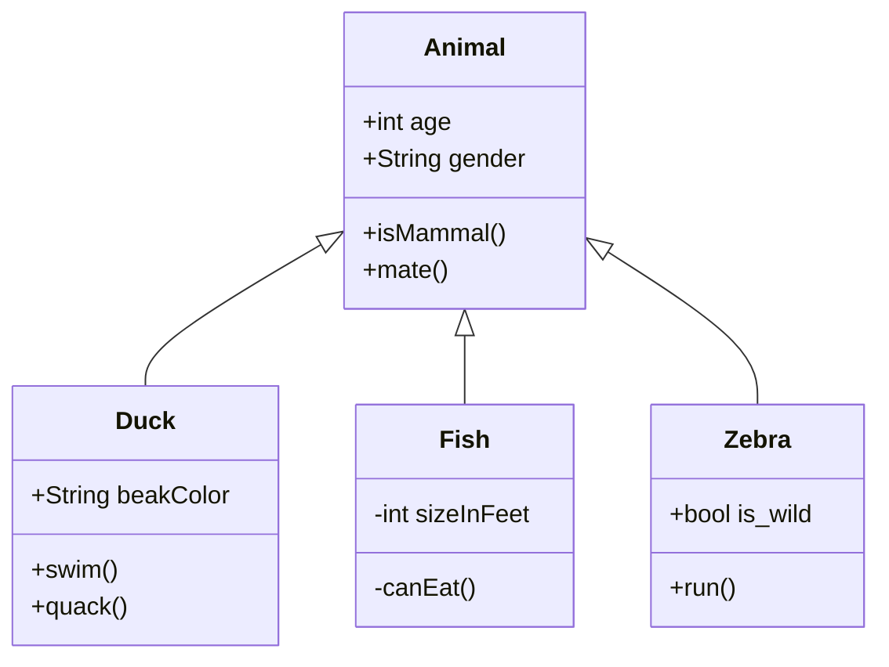
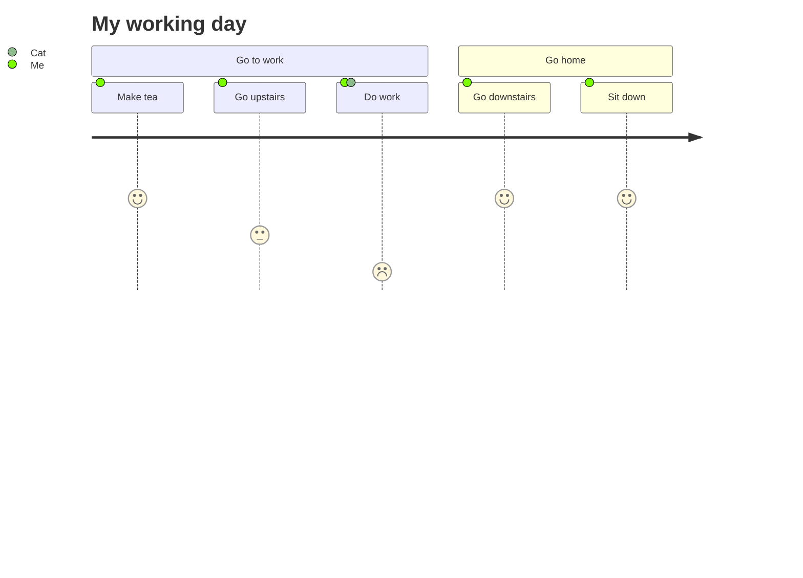

# Intro to Slidev

Das Powerpoint für Entwickler

<carbon-link />[enolive.github.io/intro-to-slidev](https://enolive.github.io/intro-to-slidev)

<div class="abs-tr">
  <a href="https://github.com/enolive/intro-to-slidev" target="_blank" alt="GitHub"
    class="text-xl icon-btn !border-none !hover:text-white">
    <carbon-logo-github />
  </a>
  <a href="https://enolive.github.io/intro-to-slidev/slidev-exported.pdf" alt="Download PDF"
    class="text-xl icon-btn !border-none !hover:text-white">
    <carbon-download />
  </a>
</div>

---
layout: center
---

# Warum?

Powerpoint & Co sind nicht für Entwickler gemacht!


---
layout: quote
author: "Kamelopedia: Porno-Point-Präsentation"
link: http://kamelopedia.net/wiki/Porno-Point-Pr%C3%A4sentation
---

Die Porno-Point-Präsentation ist ein **modernes Folterinstrument** auf Basis des **allseits verhassten Diaabendes** bei Freunden und den Schwiegereltern

<style>
p {
  @apply font-light;
}
</style>

---

# Richtiger Fokus

<Youtube id="Iwpi1Lm6dFo" />

<fa-youtube/>[How to avoid death by PowerPoint](https://www.youtube.com/watch?v=Iwpi1Lm6dFo)

<mdi-arrow-right-circle-outline/>
Gute Präsentationen sollten sich auf Inhalt statt Layout konzentrieren!

---

# Syntax Highlighting

Code wird automatisch hervorgehoben!

```java
class App {
  public static void main(String[] args) {
    System.out.println("Hello, World!");
  }
}
```

<div v-click>
  
... Auch für exotischere Sprachen 😉.
  

```haskell
fizzBuzz :: Int -> [String]
fizzBuzz n = take n $ zipWith max fizzBuzzes numbers
  where
    fizzBuzzes = zipWith (++) fizzes buzzes
    fizzes = cycle ["", "", "Fizz"]
    buzzes = cycle ["", "", "", "", "Buzz"]
    numbers = show <$> [1..]
```

</div>


---

# Diagramme

<div class="grid grid-cols-2 gap-4">

<div>
  
Diagramme mit [Mermaid](https://mermaid-js.github.io) direkt einbetten!
  
  

</div>

<div v-click>
  
...auch ausgefallenere Dinge als UML 😉.



</div>

</div>


---

# Versionierung

Plain-text lässt sich einfacher versionieren als Binary Files!

---

# Slidev Quick Facts

- [sli.dev](https://sli.dev)
- Basiert auf Vue.JS 3.x
- Responsive
- Markdown Syntax
- CSS Customizing möglich inkl. [Windi CSS](https://windicss.org/)


---

# Wie fange ich an?

1. Installation mit `npm init slidev`
2. <span class="opacity-50">Theme anpassen (optional)</span>

```yaml
theme: datev-scc
```

3. Inhalt in `slides.md` schreiben!

---

# Editor

[VS Code](https://code.visualstudio.com/) mit Extensions für [Windi CSS](https://marketplace.visualstudio.com/items?itemName=voorjaar.windicss-intellisense) und [Slidev](https://marketplace.visualstudio.com/items?itemName=antfu.slidev)

Meine `settings.json`

```json
{
  "css.validate": false,
  "editor.quickSuggestions": {
    "strings": true
  },
  "windicss.includeLanguages": {
    "markdown": "html",
    "md": "html"
  }
}
```

<!--
Zur Not geht aber auch der Web Browser!
-->

---

# 🙏 Danke! 🙏

- <carbon-link /> [sli.dev](https://sli.dev)
- <carbon-logo-github /> [github.com/enolive/intro-to-slidev](https://github.com/enolive/intro-to-slidev)
- <mdi-npm /> [npmjs.com/package/slidev-theme-datev-scc](https://www.npmjs.com/package/slidev-theme-datev-scc)
